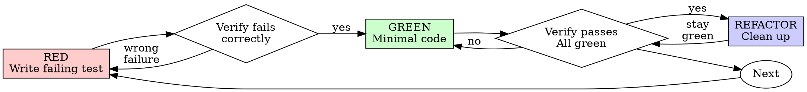

# Test-Driven Development (TDD)

## Overview

Write the test first. Watch it fail. Write minimal code to pass.

**Core principle:** If you didn't watch the test fail, you don't know if it tests the right thing.

**Violating the letter of the rules is violating the spirit of the rules.**

## When to Use

Every change that can break gets a test that names its break (see
writing-good-tests.md). Tests are for catching bugs, never for coverage
numbers. How strictly they come first depends on the change's class (superpowers:using-superpowers, "Right-Size the
Process"):

**High-risk — full red-green, the Iron Law applies:**
- Bug fixes (reproduce the bug with a failing test before touching code)
- Branching logic with edge cases: parsing, validation, calculations,
  state machines
- Concurrency, persistence and migrations, auth/security, money
- Public API contracts other code depends on
- Refactoring code that has no tests (write characterization tests first)

**Standard — tests alongside the code (see "Standard Changes" below):**
- Wiring, glue, UI, a new flag or field, a small endpoint, plumbing an
  existing value through — bounded changes with none of the traits above

**Trivial — no new test; run the existing ones:**
- Copy, comments, docs, renames, formatting, config values, dependency
  bumps, generated code, throwaway prototypes

Unsure which class? Take the stricter one. Calling risky code "standard"
to skip the red step is the rationalization this skill exists to stop.

## Standard Changes

Write the code and its tests in the same pass, then run the affected
tests. What still holds:

- Every new behavior has a test that asserts the behavior itself (a
  value, a rendered state, a call made) — not merely that nothing threw.
- A new test that passes on the first run proves little. For any test
  whose assertion you are not sure would fail without your change,
  break the change briefly (comment out the line, flip the condition),
  watch the test fail, and restore it. That one check is cheaper than a
  full red-first cycle and catches the same useless test.
- Anything you discover mid-change that is high-risk (an edge case, a
  bug) switches that part to the red-green cycle below.

**No test is a valid Standard outcome** for pure wiring, UI layout or
forwarding with no logic: if you cannot name a production change that a
test would catch, writing one only inflates coverage. Say so in one line
to your human partner and run the existing tests instead.

## Test Budget (keep the suite lean)

- Extend an existing table-driven test with a new row before adding a new
  test function.
- Delete or merge tests your change made redundant (same behavior asserted
  twice, copy-paste variants differing only in data).
- Never prune on line coverage alone: same lines run is not same behavior
  asserted. **Always keep** regression guards for a named bug, API
  contracts, invariants, race/concurrency tests, and per-fixture data
  tests; coverage cannot see these.
- Suite bloated or slow? Use `test-suite-cleanup` if the project has it
  (metrics first, review each drop candidate, verify or restore).

## The Iron Law (high-risk code)

```
NO HIGH-RISK PRODUCTION CODE WITHOUT A FAILING TEST FIRST
```

Wrote high-risk code before the test? Delete it. Start over.

**No exceptions:**
- Don't keep it as "reference"
- Don't "adapt" it while writing tests
- Don't look at it
- Delete means delete

Implement fresh from tests. Period.

## Red-Green-Refactor



### RED - Write Failing Test

Write one minimal test showing what should happen.

<Good>
```typescript
test('retries failed operations 3 times', async () => {
  let attempts = 0;
  const operation = () => {
    attempts++;
    if (attempts < 3) throw new Error('fail');
    return 'success';
  };

  const result = await retryOperation(operation);

  expect(result).toBe('success');
  expect(attempts).toBe(3);
});
```
Clear name, tests real behavior, one thing
</Good>

<Bad>
```typescript
test('retry works', async () => {
  const mock = jest.fn()
    .mockRejectedValueOnce(new Error())
    .mockRejectedValueOnce(new Error())
    .mockResolvedValueOnce('success');
  await retryOperation(mock);
  expect(mock).toHaveBeenCalledTimes(3);
});
```
Vague name, tests mock not code
</Bad>

**Requirements:**
- One behavior
- Clear name
- Real code (no mocks unless unavoidable)

### Verify RED - Watch It Fail

**MANDATORY. Never skip.**

```bash
npm test path/to/test.test.ts
```

Confirm:
- Test fails (not errors)
- Failure message is expected
- Fails because feature missing (not typos)

**Test passes?** You're testing existing behavior. Fix test.

**Test errors?** Fix error, re-run until it fails correctly.

### GREEN - Minimal Code

Write simplest code to pass the test.

<Good>
```typescript
async function retryOperation<T>(fn: () => Promise<T>): Promise<T> {
  for (let i = 0; i < 3; i++) {
    try {
      return await fn();
    } catch (e) {
      if (i === 2) throw e;
    }
  }
  throw new Error('unreachable');
}
```
Just enough to pass
</Good>

<Bad>
```typescript
async function retryOperation<T>(
  fn: () => Promise<T>,
  options?: {
    maxRetries?: number;
    backoff?: 'linear' | 'exponential';
    onRetry?: (attempt: number) => void;
  }
): Promise<T> {
  // YAGNI
}
```
Over-engineered
</Bad>

Don't add features, refactor other code, or "improve" beyond the test.

### Verify GREEN - Watch It Pass

**MANDATORY.**

```bash
npm test path/to/test.test.ts
```

Confirm:
- Test passes
- The tests for the code you touched still pass (the file, package or
  module — not the whole suite on every cycle)
- Output pristine (no errors, warnings)

**Test fails?** Fix code, not test.

**Other tests fail?** Fix now.

**Iterate on the affected tests; at the end, "other tests" means the
project's suite, not just your file.** A green run of the test you wrote
is not a green suite. Before you call the change done, run the project's
full test command once (bare `pytest`,
`npm test`, `cargo test` — whatever the repo uses) even when your task
named only one test file. A scope statement in your task bounds the
deliverable, not your verification. Any failure that run shows —
including one you didn't cause — goes in your report by name; a red
test you watched scroll past and didn't mention is a report falsified
by omission.

### REFACTOR - Clean Up

After green only:
- Remove duplication
- Improve names
- Extract helpers

Keep tests green. Don't add behavior.

### Repeat

Next failing test for next feature.

## Good Tests

| Quality | Good | Bad |
|---------|------|-----|
| **Minimal** | One thing. "and" in name? Split it. | `test('validates email and domain and whitespace')` |
| **Clear** | Name describes behavior | `test('test1')` |
| **Shows intent** | Demonstrates desired API | Obscures what code should do |

When writing or changing any test, read [writing-good-tests.md](writing-good-tests.md) for the rules that keep tests honest:
- Name the production change that would make the test fail — before writing it
- Assert on real behavior, never on mock behavior
- Keep test-only code in test utilities, out of production classes
- Understand a dependency's side effects before mocking it

## Common Rationalizations

These answer attempts to skip the red step on **high-risk** code. On a
standard change, writing tests alongside the code is the rule, not a
rationalization — but "too simple to test" never applies to any behavior
change.

| Excuse | Reality |
|--------|---------|
| "Too simple to test" | Simple code breaks. Test takes 30 seconds. |
| "I'll test after" | Tests written after pass immediately — which proves nothing. They may test the wrong thing, test the implementation instead of the behavior, or miss the edge case you forgot. You never watched it fail, so you never proved it can catch the bug. Test-first forces that failure. |
| "Tests after achieve same goals (spirit not ritual)" | Tests-after answer "what does this do?"; tests-first answer "what should this do?" Tests written after are biased by the code you already wrote — you verify the cases you remembered, not the ones you'd have discovered. Coverage without proof the tests work. |
| "Already manually tested" | Manual testing is ad-hoc: no record of what you covered, no way to re-run it when the code changes, easy to forget cases under pressure. "Worked when I tried it" ≠ comprehensive. Automated tests run the same way every time. |
| "Deleting X hours is wasteful" | Sunk cost fallacy — that time is already spent either way. The real choice: rewrite with TDD (high confidence) vs. keep it and bolt tests on after (low confidence, likely bugs). Keeping code you can't trust is the waste. |
| "Keep as reference, write tests first" | You'll adapt it. That's testing after. Delete means delete. |
| "Need to explore first" | Fine. Throw away exploration, start with TDD. |
| "Test hard = design unclear" | Listen to test. Hard to test = hard to use. |
| "TDD will slow me down" | TDD IS the pragmatic path: catches bugs before commit, prevents regressions, lets you refactor without fear. "Pragmatic" shortcuts mean debugging in production — slower, not faster. |
| "Manual test faster" | Manual doesn't prove edge cases. You'll re-test every change. |
| "Existing code has no tests" | You're improving it. Add tests for existing code. |

## Red Flags - STOP and Start Over (high-risk code)

- Code before test
- Test after implementation
- Test passes immediately
- Can't explain why test failed
- Tests added "later"
- Rationalizing "just this once"
- "I already manually tested it"
- "Tests after achieve the same purpose"
- "It's about spirit not ritual"
- "Keep as reference" or "adapt existing code"
- "Already spent X hours, deleting is wasteful"
- "TDD is dogmatic, I'm being pragmatic"
- "This is different because..."

**For high-risk code, all of these mean: Delete code. Start over with TDD.**
For a standard change, the fix is to add the missing behavioral test and
check it can fail — see "Standard Changes".

## Example: Bug Fix

**Bug:** Empty email accepted

**RED**
```typescript
test('rejects empty email', async () => {
  const result = await submitForm({ email: '' });
  expect(result.error).toBe('Email required');
});
```

**Verify RED**
```bash
$ npm test
FAIL: expected 'Email required', got undefined
```

**GREEN**
```typescript
function submitForm(data: FormData) {
  if (!data.email?.trim()) {
    return { error: 'Email required' };
  }
  // ...
}
```

**Verify GREEN**
```bash
$ npm test
PASS
```

**REFACTOR**
Extract validation for multiple fields if needed.

## Verification Checklist

Before marking work complete:

- [ ] Every new behavior that can break has a test naming its break;
      trivial wiring/getters/constants do not need one
- [ ] No redundant tests left behind (Test Budget)
- [ ] High-risk code: watched each test fail before implementing.
      Standard change: each unsure test was seen to fail once (break-check)
- [ ] Each test failed for expected reason (feature missing, not typo)
- [ ] Wrote minimal code to pass each test
- [ ] All tests pass
- [ ] Output pristine (no errors, warnings)
- [ ] Tests use real code (mocks only if unavoidable)
- [ ] Edge cases and errors covered

Can't check all boxes? You skipped TDD. High-risk: start over. Standard:
add what's missing.

## When Stuck

| Problem | Solution |
|---------|----------|
| Don't know how to test | Write wished-for API. Write assertion first. Ask your human partner. |
| Test too complicated | Design too complicated. Simplify interface. |
| Must mock everything | Code too coupled. Use dependency injection. |
| Test setup huge | Extract helpers. Still complex? Simplify design. |

## Debugging Integration

Bug found? Write failing test reproducing it. Follow TDD cycle. Test proves fix and prevents regression.

Never fix bugs without a test.

## Final Rule

```
High-risk production code → test exists and failed first
Standard change → behavioral test exists and can fail
Wiring with no nameable break → no new test, existing tests run
Otherwise → not done
```

Downgrading a change to a lighter class once you have classified it needs
your human partner's permission.
